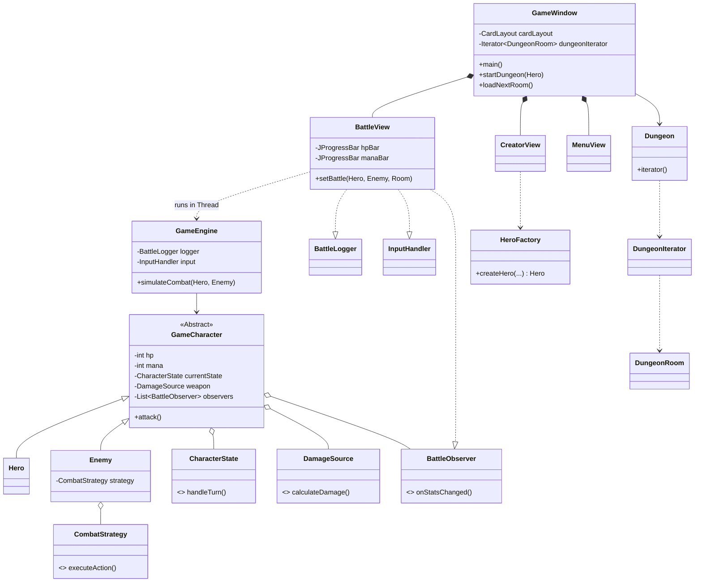

# Dokumentacja Techniczna JavaRPG-Core (Wersja Finalna)

**Wersja:** 3.1 (Bez Memento)  
**Data:** 2026-01-26

---

## 1. Rozszerzona Architektura Systemu

System JavaRPG-Core został zaprojektowany w architekturze warstwowej, separującej logikę gry od interfejsu użytkownika, zgodnie z zasadami SOLID.

### Warstwy Aplikacji

1.  **Model (Domenowy)**:
    - Zawiera encje (`Hero`, `Enemy`, `GameCharacter`) oraz logikę biznesową.
    - Implementuje kluczowe wzorce: **State** (logika tury), **Strategy** (AI), **Decorator** (modyfikacje broni).
    - Warstwa trwała: `CharacterRepository` wykorzystujący **Hibernate (JPA)** i bazę H2.

2.  **View (Swing UI)**:
    - **Kontener**: `GameWindow` (JFrame) zarządza głównymi ekranami.
    - **Zarządzanie Widokami**: Wykorzystanie `CardLayout` pozwala na płynne przełączanie między `MenuView` (Menu), `CreatorView` (Kreator) i `BattleView` (Walka) w obrębie jednego okna.
    - **Reaktywność**: `BattleView` implementuje interfejs `BattleObserver`, aby automatycznie reagować na zmiany w modelu (np. spadek HP).

3.  **Service / Controller**:
    - **Silnik (`GameEngine`)**: Centralny komponent sterujący pętlą gry.
    - **Abstrakcja I/O**: Dzięki interfejsom `BattleLogger` i `InputHandler`, silnik jest całkowicie niezależny od technologii UI (działa w konsoli i w Swingu).
    - **Fabryka (`HeroFactory`)**: Separuje logikę tworzenia skomplikowanych obiektów (dekorowania broni) od warstwy prezentacji.

### Responsywność i Wielowątkowość

Aby uniknąć "zamrożenia" interfejsu graficznego (Event Dispatch Thread) podczas symulacji walki:

- Pętla `simulateCombat` w `GameEngine` jest uruchamiana w **osobnym wątku** (`new Thread()`).
- Interakcje z UI (aktualizacja pasków, logi tekstowe, włączanie przycisków) są delegowane z powrotem do wątku UI za pomocą `SwingUtilities.invokeLater()`.
- Synchronizacja tury gracza odbywa się za pomocą `CountDownLatch` w `BattleView`, co pozwala zatrzymać wątek gry w oczekiwaniu na kliknięcie przycisku, nie blokując wątku UI.

---

## 2. Integracja Wzorców Projektowych z GUI

Projekt wykorzystuje 5 wzorców projektowych GoF, które są ściśle zintegrowane z interfejsem użytkownika.

| Wzorzec       | Zastosowanie w Logice         | Integracja z GUI                                                                                                                                  |
| :------------ | :---------------------------- | :------------------------------------------------------------------------------------------------------------------------------------------------ |
| **Decorator** | `new FireEnchantment(weapon)` | **Kreator Postaci**: Checkboxy w `CreatorView` są mapowane przez `HeroFactory` na dynamiczne nakładanie dekoratorów na obiekt broni.              |
| **Strategy**  | `enemy.setStrategy(...)`      | **Walka**: Typ przeciwnika determinuje jego zachowanie AI. GUI jedynie wyświetla skutki decyzji (np. leczenie wroga), które zapadają w strategii. |
| **State**     | `currentState.handleTurn()`   | **Paski Statusu**: Efekty stanów (np. Trucizna, Ogłuszenie) są automatycznie logowane w `JTextArea`.                                              |
| **Observer**  | `subject.notifyObservers()`   | **Paski Postępu**: `BattleView` obserwuje obiekt `Hero`. Każda zmiana HP/Many w modelu natychmiast odświeża paski `JProgressBar`.                 |
| **Iterator**  | `dungeon.iterator()`          | **Eksploracja**: `GameWindow` używa iteratora do ładowania kolejnych pokoi (`DungeonRoom`) po kliknięciu przycisku "Dalej".                       |

---

## 3. Pełny Przepływ Danych (End-to-End)

Ścieżka danych od uruchomienia do zapisu wyniku:

1.  **Inicjalizacja**: Uruchomienie `GameWindow`. Wyświetlenie `MenuView`.
2.  **Tworzenie Postaci**:
    - Użytkownik klika "Nowa Gra".
    - Wypełnia formularz w `CreatorView`.
    - `HeroFactory` buduje obiekt obiektu `Hero` z dekorowaną bronią.
3.  **Start Symulacji**:
    - `GameWindow` inicjuje `Dungeon`.
    - Pobranie pierwszego pokoju z `DungeonIterator`.
    - Przekazanie `Hero` i `Enemy` do `BattleView`.
4.  **Pętla Walki (GameEngine)**:
    - **Tura Gracza**: Silnik prosi o akcję (`InputHandler.getAction()`). Wątek gry czeka.
    - Użytkownik klika przycisk w GUI. Wątek rusza.
    - Wykonanie logiki, aktualizacja modelu.
    - `notifyObservers()` -> Aktualizacja pasków w GUI.
    - **Tura Wroga**: Wykonanie strategii AI.
5.  **Zakończenie**:
    - Gdy HP jednej ze stron <= 0.
    - Wyświetlenie Dialogu z wynikiem.
    - `CharacterRepository` zapisuje zwycięzcę w bazie danych H2.

---

## 4. Instrukcja Uruchomienia

### Wymagania

- **Java JDK 17** lub nowsza.
- **Maven**.

### Klasy Uruchomieniowe

Aplikacja posiada dwa punkty wejścia:

1.  `com.rpg.core.ui.GameWindow` - **Pełna wersja z GUI (Zalecana)**.
2.  `com.rpg.core.Main` - Wersja demonstracyjna konsolowa.

### Komendy (Terminal)

```bash
# Kompilacja projektu
mvn clean compile

# Uruchomienie wersji Okienkowej (GUI)
mvn exec:java -Dexec.mainClass="com.rpg.core.ui.GameWindow"
```

---

## 5. Diagram UML (Mermaid)



---

## 6. Podsumowanie SOLID

Implementacja systemu z GUI pozwoliła na praktyczną weryfikację zasad SOLID:

- **Single Responsibility Principle (SRP)**:
  - Logika walki (`GameEngine`) jest całkowicie odseparowana od logiki wyświetlania (`BattleView`).
  - Widoki (`JPanel`) zajmują się tylko prezentacją, a tworzenie obiektów delegują do fabryk/kontrolerów.
- **Open/Closed Principle (OCP)**:
  - Możemy dodać nowe widoki do `GameWindow` bez zmiany logiki nawigacji.
  - Możemy dodać nowe typy broni/dekoratorów w `HeroFactory` bez zmiany kodu `CreatorView`.
- **Interface Segregation Principle (ISP)**:
  - `GameEngine` wymaga interfejsów `BattleLogger` i `InputHandler`, a nie pełnej klasy `BattleView`. Dzięki temu silnik widzi tylko to, czego potrzebuje.
