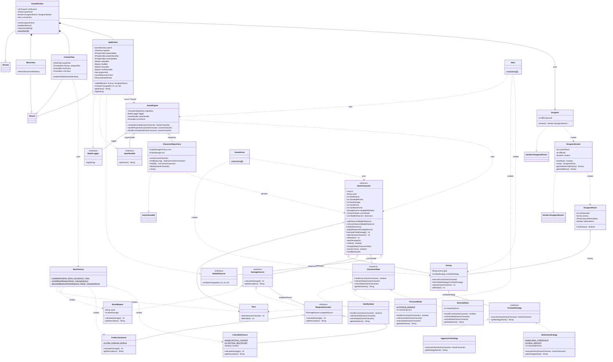

# UML Class Diagram — JavaRPG

```mermaid
classDiagram
    direction TB

    %% ══════════════════════════════════════
    %% ENTITY LAYER
    %% ══════════════════════════════════════

    class GameCharacter {
        <<Abstract>>
        -Long id
        -String name
        -int healthPoints
        -int maxHealthPoints
        -int baseDamage
        -int manaPoints
        -int maxManaPoints
        -DamageSource equippedWeapon
        -CharacterState currentState
        -List~BattleObserver~ observers
        +addObserver(BattleObserver)
        +removeObserver(BattleObserver)
        #notifyObservers()
        +equipWeapon(DamageSource)
        #calculateTotalDamage() int
        +attack(GameCharacter)* int
        +defend(int)* int
        +takeDamage(int)
        +isAlive() boolean
        +changeState(CharacterState)
        +processTurn() boolean
        +modifyMana(int)
    }

    class Hero {
        +attack(GameCharacter) int
        +defend(int) int
    }

    class Enemy {
        -String enemyType
        -CombatStrategy combatStrategy
        +executeTurn(GameCharacter)
        +setCombatStrategy(CombatStrategy)
        +attack(GameCharacter) int
        +defend(int) int
    }

    GameCharacter <|-- Hero
    GameCharacter <|-- Enemy

    %% ══════════════════════════════════════
    %% WEAPON / DECORATOR PATTERN
    %% ══════════════════════════════════════

    class DamageSource {
        <<Interface>>
        +calculateDamage() int
        +getDescription() String
    }

    class BaseWeapon {
        -String name
        -int baseDamage
        +calculateDamage() int
        +getDescription() String
    }

    class WeaponDecorator {
        <<Abstract>>
        #DamageSource wrappedSource
        +calculateDamage() int
        +getDescription() String
    }

    class FireEnchantment {
        -int FIRE_DAMAGE_BONUS$
        +calculateDamage() int
        +getDescription() String
    }

    class CriticalHitChance {
        -double CRITICAL_CHANCE$
        -int CRITICAL_MULTIPLIER$
        -Random random
        +calculateDamage() int
        +getDescription() String
    }

    DamageSource <|.. BaseWeapon
    DamageSource <|.. WeaponDecorator
    WeaponDecorator <|-- FireEnchantment
    WeaponDecorator <|-- CriticalHitChance
    WeaponDecorator o-- DamageSource : wrappedSource

    GameCharacter o-- DamageSource : equippedWeapon

    %% ══════════════════════════════════════
    %% STATE PATTERN
    %% ══════════════════════════════════════

    class CharacterState {
        <<Interface>>
        +handleTurn(GameCharacter) boolean
        +onEnterState(GameCharacter)
        +onExitState(GameCharacter)
        +getStateName() String
    }

    class HealthyState {
        +handleTurn(GameCharacter) boolean
        +onEnterState(GameCharacter)
        +onExitState(GameCharacter)
        +getStateName() String
    }

    class PoisonedState {
        -int POISON_DAMAGE$
        -int remainingTurns
        +handleTurn(GameCharacter) boolean
        +onEnterState(GameCharacter)
        +onExitState(GameCharacter)
        +getStateName() String
    }

    class StunnedState {
        -int remainingTurns
        +handleTurn(GameCharacter) boolean
        +onEnterState(GameCharacter)
        +onExitState(GameCharacter)
        +getStateName() String
    }

    CharacterState <|.. HealthyState
    CharacterState <|.. PoisonedState
    CharacterState <|.. StunnedState

    GameCharacter o-- CharacterState : currentState

    %% ══════════════════════════════════════
    %% STRATEGY PATTERN
    %% ══════════════════════════════════════

    class CombatStrategy {
        <<Interface>>
        +executeAction(GameCharacter, GameCharacter)
        +getStrategyName() String
    }

    class AggressiveStrategy {
        +executeAction(GameCharacter, GameCharacter)
        +getStrategyName() String
    }

    class DefensiveStrategy {
        -double HEAL_THRESHOLD$
        -int HEAL_AMOUNT$
        -int maxHealthPoints
        +executeAction(GameCharacter, GameCharacter)
        +getStrategyName() String
    }

    CombatStrategy <|.. AggressiveStrategy
    CombatStrategy <|.. DefensiveStrategy

    Enemy o-- CombatStrategy : combatStrategy

    %% ══════════════════════════════════════
    %% OBSERVER PATTERN
    %% ══════════════════════════════════════

    class BattleObserver {
        <<Interface>>
        +onStatsChanged(int, int, int, int)
    }

    GameCharacter o-- BattleObserver : observers

    %% ══════════════════════════════════════
    %% ITERATOR PATTERN / EXPLORATION
    %% ══════════════════════════════════════

    class Dungeon {
        -int difficultyLevel
        +iterator() Iterator~DungeonRoom~
    }

    class DungeonRoom {
        -int roomNumber
        -Enemy enemy
        -String treasureDescription
        -boolean isBossRoom
        +hasEnemy() boolean
    }

    class DungeonIterator {
        -int currentRoom
        -int difficulty
        -Random random
        +hasNext() boolean
        +next() DungeonRoom
        -generateNormalEnemy() Enemy
        -generateBoss() Enemy
    }

    Dungeon ..|> Iterable~DungeonRoom~
    DungeonIterator ..|> Iterator~DungeonRoom~
    Dungeon ..> DungeonIterator : creates
    DungeonIterator ..> DungeonRoom : creates
    DungeonRoom o-- Enemy : enemy

    %% ══════════════════════════════════════
    %% SERVICE LAYER
    %% ══════════════════════════════════════

    class BattleLogger {
        <<Interface>>
        +log(String)
    }

    class InputHandler {
        <<Interface>>
        +getAction() String
    }

    class GameEngine {
        -CharacterRepository repository
        -BattleLogger logger
        -InputHandler inputHandler
        -Runnable onTurnEnd
        +simulateCombat(GameCharacter, GameCharacter)
        -handlePlayerAction(GameCharacter, GameCharacter)
        -handleCombatEnd(GameCharacter, GameCharacter)
    }

    GameEngine o-- BattleLogger : logger
    GameEngine o-- InputHandler : inputHandler
    GameEngine o-- CharacterRepository : repository
    GameEngine ..> GameCharacter : uses

    %% ══════════════════════════════════════
    %% FACTORY
    %% ══════════════════════════════════════

    class HeroFactory {
        +createHero(String, String, List~String~)$ Hero
        -createBaseWeapon(String)$ DamageSource
        -decorateWeapon(DamageSource, String)$ DamageSource
    }

    HeroFactory ..> Hero : creates
    HeroFactory ..> BaseWeapon : creates
    HeroFactory ..> FireEnchantment : creates
    HeroFactory ..> CriticalHitChance : creates

    %% ══════════════════════════════════════
    %% REPOSITORY
    %% ══════════════════════════════════════

    class CharacterRepository {
        -EntityManagerFactory emf
        -EntityManager em
        +save(GameCharacter)
        +findById(Long) Optional~GameCharacter~
        +findAll() List~GameCharacter~
        +delete(GameCharacter)
        +close()
    }

    CharacterRepository ..|> AutoCloseable
    CharacterRepository ..> GameCharacter : persists

    %% ══════════════════════════════════════
    %% UI LAYER
    %% ══════════════════════════════════════

    class GameWindow {
        -CardLayout cardLayout
        -JPanel mainPanel
        -Iterator~DungeonRoom~ dungeonIterator
        -Hero currentHero
        +startDungeon(Hero)
        +loadNextRoom()
        +showView(String)
        +main(String[])$
    }

    class MenuView {
        +MenuView(GameWindow)
    }

    class CreatorView {
        -JTextField nameField
        -JComboBox~String~ weaponBox
        -JCheckBox fireCheck
        -JCheckBox critCheck
        -createAndStart(GameWindow)
    }

    class BattleView {
        -GameWindow parent
        -JTextArea logArea
        -JProgressBar playerHpBar
        -JProgressBar playerManaBar
        -JProgressBar enemyHpBar
        -JButton attackBtn
        -JButton healBtn
        -JButton heavyBtn
        -JButton nextRoomBtn
        -Hero playerHero
        -CountDownLatch latch
        -String selectedAction
        +setBattle(Hero, Enemy, DungeonRoom)
        +onStatsChanged(int, int, int, int)
        +getAction() String
        +log(String)
    }

    GameWindow --|> JFrame
    MenuView --|> JPanel
    CreatorView --|> JPanel
    BattleView --|> JPanel

    GameWindow *-- MenuView
    GameWindow *-- CreatorView
    GameWindow *-- BattleView
    GameWindow --> Dungeon : uses

    BattleView ..|> BattleLogger
    BattleView ..|> InputHandler
    BattleView ..|> BattleObserver
    BattleView ..> GameEngine : runs in Thread
    CreatorView ..> HeroFactory : uses

    %% ══════════════════════════════════════
    %% ENTRY POINTS
    %% ══════════════════════════════════════

    class Main {
        +main(String[])$
    }

    class GameDemo {
        +main(String[])$
    }

    Main ..> GameEngine : uses
    Main ..> Hero : creates
    Main ..> Enemy : creates
    GameDemo ..> Enemy : creates
    GameDemo ..> GameCharacter : uses
```
